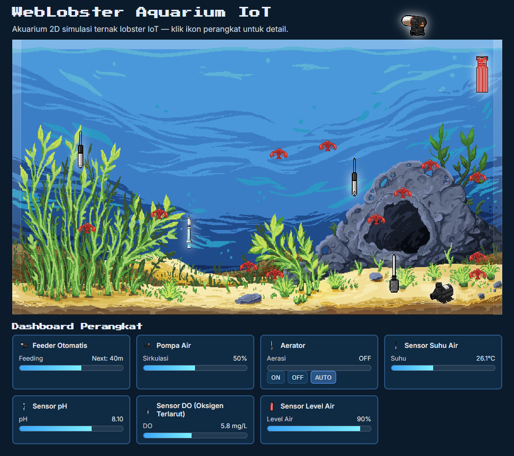

# WebLobster Aquarium IoT (Vanilla HTML/CSS/JS)

Single-page app akuarium 2D pixel-art responsif dengan lobster PNG, sensor/aktuator data-driven, dashboard metrik (bars), dan efek bubble aerator yang natural.

*Screenshot: assets/Screenshot.png*

## Fitur Utama
- Aquarium 2D pixel-art simulasi ternak lobster IoT.
- 7 lobster PNG: wander acak, flip arah, dan tetap dalam batas.
- Perangkat dari `data/devices.json`: posisi relatif, tooltip, modal foto dengan typewriter yang dapat dibaca.
- Dashboard bars: update tiap 4 detik dengan nilai dummy yang tetap masuk akal per tipe.
- Aerator bubble: ON/OFF/AUTO (AUTO menyala saat DO < 6.0 mg/L); gelembung membesar, naik pelan, dan fade-out lambat.

## Struktur
- `index.html` — shell, canvas aquarium, layer ikon, modal, dashboard.
- `styles.css` — tema, pixel rendering, tooltip, modal pop-in, dashboard cards & bars.
- `app.js` — background (`assets/web/aquarium_bg.*`), lobster PNG, load `devices.json`, ikon `assets/web/*_pixel.png`, modal & typing, dashboard bars, aerator controls & bubble.
- `data/devices.json` — daftar perangkat (id, type, name, x,y, photo, description).
- `assets/photos/` — foto perangkat untuk modal.
- `assets/web/` — aset UI (ikon `*_pixel.png`, `lobster_pixel.*`, `aquarium_bg.*`, `bubble_pixel.png`).

## Kontrol & Kustomisasi
- Ubah/tambah perangkat di `data/devices.json` (koordinat `x,y` dalam fraction 0..1).
- Pastikan ikon tersedia di `assets/web/*_pixel.png`.
- Aerator mode: ON, OFF, atau AUTO (berdasarkan DO).

## Aksesibilitas & Performa
- Modal aksesibel, tutup via tombol/overlay/`Esc`, fokus kembali ke pemicu.
- Pixelated rendering untuk sprites dan canvas.
- Dashboard update per 4 detik, nilai dummy logis.
